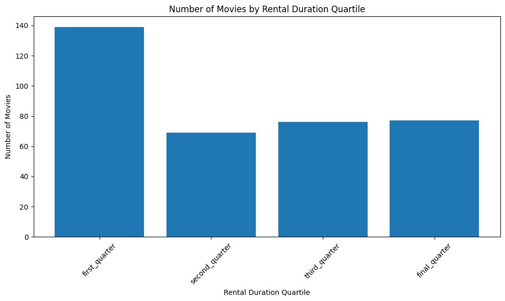
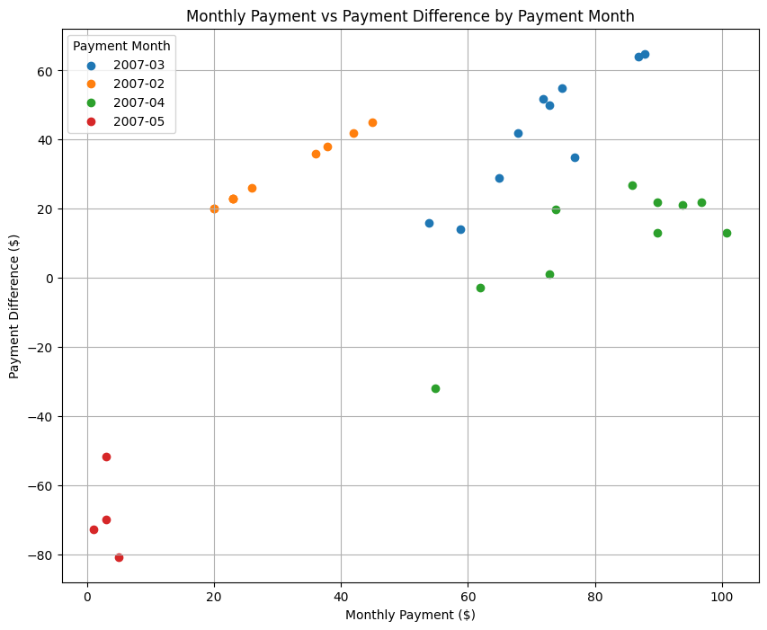

# Project: Investigate a Relational Database
Author: Nhan V. Ng
Date: 2024/03/05


```python
!pip install pandas matplotlib
```


```python
import pandas as pd
import matplotlib.pyplot as plt
```

### Question 1
Lists each movie, the film category it is classified in, and the number of times it has been rented out.


```python
df = pd.read_csv('data/s1_q1.csv')

# Aggregate data by category and calculate total rental counts
category_rentals = df.groupby('category_name')['rental_count'].sum()

# Plot scatter graph
plt.figure(figsize=(10, 6))
plt.scatter(category_rentals.index, category_rentals.values, color='blue')
plt.title('Total Rental Counts by Category')
plt.xlabel('Category Name')
plt.ylabel('Total Rental Count')
plt.xticks(rotation=90)  # Rotate x-axis labels for better readability
plt.tight_layout()  # Adjust layout to prevent clipping of labels
plt.show()
```


    

    


### Question 2
The movie titles and divide them into 4 levels (first_quarter, second_quarter, third_quarter, and final_quarter) based on the quartiles (25%, 50%, 75%) of the average rental duration(in the number of days) for movies across all categories?


```python
import pandas as pd
import matplotlib.pyplot as plt

# Read CSV file into a pandas DataFrame
df = pd.read_csv("data/s1_q2.csv")

quartile_labels = ['first_quarter', 'second_quarter', 'third_quarter', 'final_quarter']
df['rental_duration_quartile'] = pd.qcut(df['rental_duration'], q=4, labels=quartile_labels)

quartile_counts = df['rental_duration_quartile'].value_counts()
quartile_counts = quartile_counts.sort_index()
plt.figure(figsize=(10, 6))
plt.bar(quartile_counts.index, quartile_counts.values)
plt.title('Number of Movies by Rental Duration Quartile')
plt.xlabel('Rental Duration Quartile')
plt.ylabel('Number of Movies')
plt.xticks(rotation=45) 
plt.tight_layout()
plt.show()
```


    

    


### Question 3:
Provide a table with the family-friendly film category, each of the quartiles, and the corresponding count of movies within each combination of film category for each corresponding rental duration category. The resulting table should have three columns:

    - Category
    - Rental length category
    - Count


```python
df = pd.read_csv("data/s1_q3.csv")
plt.figure(figsize=(10, 6))
bar_width = 0.15
index = df['standard_quartile'].unique()

for i, category in enumerate(df['name'].unique()):
    subset = df[df['name'] == category]
    plt.bar(index + i * bar_width, subset['count'], bar_width, label=category)

plt.xlabel('Standard Quartile')
plt.ylabel('Count')
plt.title('Movie Counts by Standard Quartile')
plt.xticks(index + bar_width * (len(df['name'].unique()) - 1) / 2, index)
plt.legend()
plt.tight_layout()
plt.show()
```


    

    


### Question 4: 
Count of rental orders during every month for all the years 


```python
df = pd.read_csv("data/s2_q1.csv")
# Group by rental_year and rental_month and sum the counts
grouped_df = df.groupby(['rental_year', 'rental_month']).sum().reset_index()

# Plotting the graph
fig, ax = plt.subplots(figsize=(10, 6))

for year in grouped_df['rental_year'].unique():
    year_data = grouped_df[grouped_df['rental_year'] == year]
    ax.plot(year_data['rental_month'], year_data['count_rentals'], label=str(year))

ax.set_title('Count of Rental Orders by Month for All Years')
ax.set_xlabel('Month')
ax.set_ylabel('Count of Rentals')
ax.legend(title='Year')
plt.xticks(range(1, 13))
plt.grid(True)
plt.show()
```


    

    


### Question 5
 Query to capture the customer name, month and year of payment, and total payment amount for each month by these top 10 paying customers?


```python
df = pd.read_csv("data/s2_q2.csv")
# Convert pay_month to datetime format
df['pay_month'] = pd.to_datetime(df['pay_month'])

# Group by full_name and plot pay_amount over time for each full_name
plt.figure(figsize=(12, 6))

for name, group in df.groupby('full_name'):
    plt.plot(group['pay_month'], group['pay_amount'], label=name)

plt.xlabel('Pay Month')
plt.ylabel('Pay Amount')
plt.title('Pay Amount Over Time')
plt.legend()
plt.xticks(rotation=45)
plt.tight_layout()
plt.show()
```


    

    


### Question 6
Query to compare the payment amounts in each successive month


```python
# Plotting
df = pd.read_csv("data/s2_q3.csv")
plt.figure(figsize=(10, 8))
for month in df['payment_month'].unique():
    subset = df[df['payment_month'] == month]
    plt.scatter(subset['monthly_payment'], subset['payment_difference'], label=month)

plt.title('Monthly Payment vs Payment Difference by Payment Month')
plt.xlabel('Monthly Payment ($)')
plt.ylabel('Payment Difference ($)')
plt.legend(title="Payment Month")
plt.grid(True)
plt.show()
```


    

    

